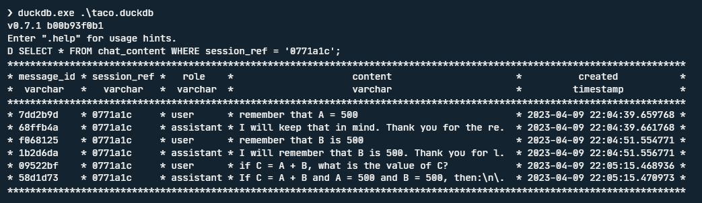

<p align="center">
    
    <br />
    <br />
    <i>
    A smart python shell for data processing, automation and much more with OpenAi's API
    </i>
    <br />
    <br />
    <a href="https://github.com/HarmonicHemispheres/tacoshell">
    </a>
    
    <br>
    
    
</p>

<br>
<br>

# 🌮 Why Tacos for Dinner?
<b style="font-size:20px;"><i>Because they are delicious!</i>🤩</b>
<details>
    <summary>
        <b style="font-size:20px;">Taco lets you view session history with OpenAi models easily</b>
    </summary>
    
</details>
<details>
    <summary>
        <b style="font-size:20px;">Easily see available OpenAi models you have access to</b>
    </summary>
    
</details>
<details>
    <summary>
        <b style="font-size:20px;">Data is stored in `DuckDB` making analysis on chat sessions easy!</b>
    </summary>
    
</details>
<details>
    <summary>
        <b style="font-size:20px;">Export Chat Sessions for external uses and analysis</b>
    </summary>
    
</details>
<details>
    <summary>
        <b style="font-size:20px;">Set custom protocals for GPT to follow (the model's 'SYSTEM')</b>
    </summary>
    
</details>


<br>
<br>
<br>


# 🌮 Get Cookin!
### Install
```
python -m pip install 'tacoshell @ git+https://github.com/HarmonicHemispheres/tacoshell@main'
```

### Create Config
Taco stores settings and configuration in the `taco.toml` file and stores chat conversation data and a few other runtime settings in `taco.db`. Note, you can get your open-ai API key from here: https://platform.openai.com/account/api-keys
```
taco init
```

### Launch Shell
```
taco chat
```


<br>
<br>
<br>


# 🦾  Commands

```
🌮 .help

<TEXT>               --  ask openai a question in the current chat session

.quit                --  exit taco shell
.help                --  list builtin commands
.clear/.clr          --  clears the console
.cfg                 --  show the config settings
.session             --  show the details of the current session and its history
.sessions            --  list chat sessions
.models              --  shows available OpenAi models
.set-session <NAME>  --  switch to a different chat session
.set-system <TEXT>   --  set a chat session 'system'. who is the ai? how do they respond?
.rm-session          --  deactivate the current session
.rm-session <NAME>   --  deactivate a specific session
.export              --  export the current chat session to csv
.export-csv          --  export the current chat session to csv
.export-json         --  export the current chat session to json
.export-xlsx         --  export the current chat session to xlsx
.export-html         --  export the current chat session to html
```

<br>

### Start a Fresh Session
this command will drop the local `taco.db` database and start a fresh one.
```
taco chat --new
```

<br>
<br>
<br>


# 🛣️ Roadmap & Ideas
### Long Term Memory
- [ ] 🔧 add simple system to allow for infinite conversation
- [ ] 🔧 add long term memory database system for memory aware infinite conversation

## File Import System
- [ ] 🔧 add file import system to add file content to chat context without copy paste
- [ ] 🔧 add reference to current working directory and way to change it. (could be used for file importing)

### Export System
- [x] 🔧 chat session content export options (simple)
  - [x] json
  - [x] csv
  - [x] xlsx
  - [x] html

### System Protocals
- [x] 🔧 add way to set a system message for a chat session to guide the ai model


### Other
- [ ] 🔧 add system to use sql to query the `taco.duckdb` database from the taco shell
- [ ] 🔧 add "Chat Commands" that allow GPT to specify commands that will run predefined python functions to enable a auto-GPT system
  - [ ] add config setting for custom "Chat Commands"
- [ ] 🔧 add way to modify temperature of models for variable control of model response behavior
- [x] 🔧 add way to remove\inactivate chat sessions
- [ ] 🔧 add way to deactivate specific messages in chat session to shape session focus
- [ ] 🔧 add update or chat content migration mechanism for database updates
- [ ] 🔧 add application logging to `.log` files for enhanced troubleshooting and details
- [ ] 🔧 add a `watch` mode, where agent tasks can perform scheduled jobs and triggers can cause a specific chat session to be prompted with some data.
- [ ] 🔧 add a documentation site in sphinx
- [ ] 🔧 add streamlit app to interact with Taco 
- [ ] 🔧 add `.info` command with details about OpenAi docs, taco statistics, python package versions and other useful details
- [ ] ♻️ refactor chat_content table to include more data about session
